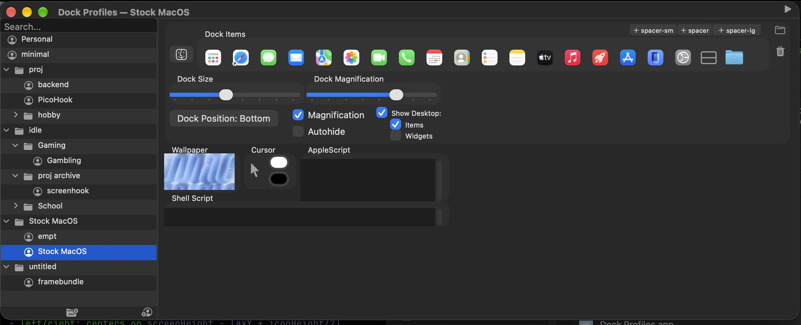

# Dock Profiles
Workspace Menubar app —change dock apps, wallpaper, run scripts, and more



**note:** has a startup bug due to extra-wide menubar icon, requires tiny menu items

```
defaults -currentHost write -globalDomain NSStatusItemSpacing -int 0
defaults -currentHost write -globalDomain NSStatusItemSelectionPadding -int 0
```
